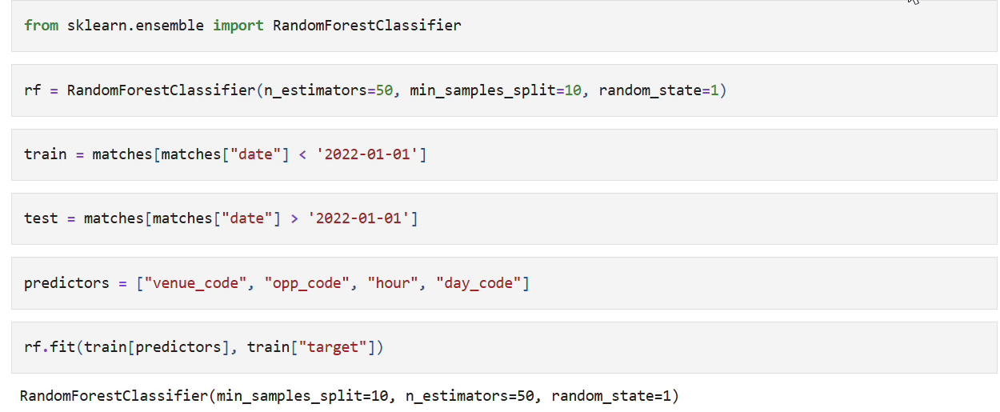
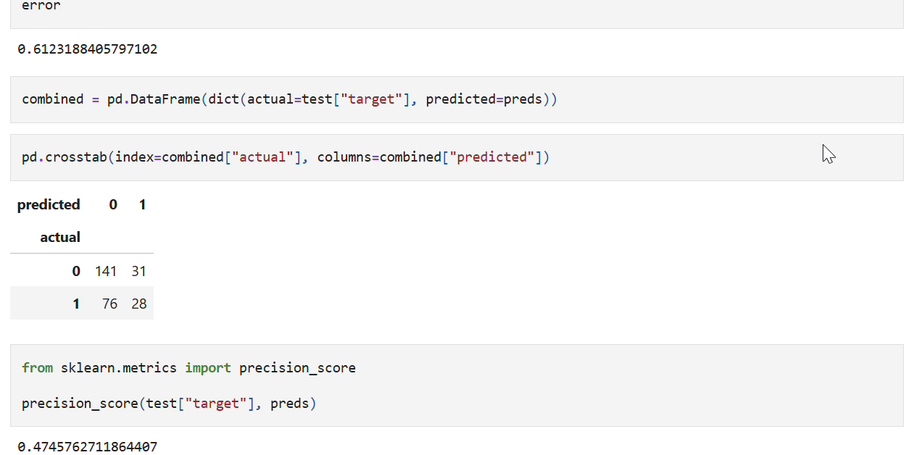
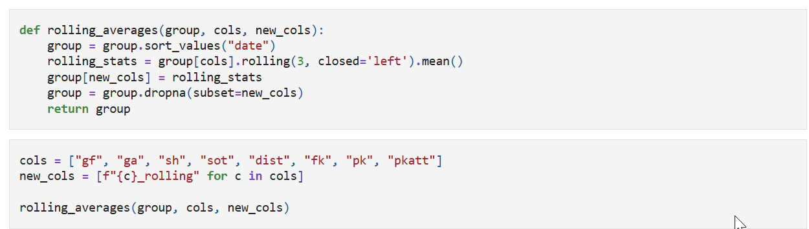
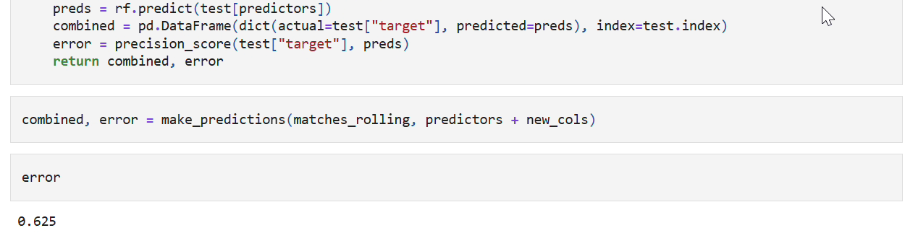

# Premier League Prediction — Midterm Research Snapshot

**Murtadaa Aliu · Junior Seminar · Weeks 1–7 scope**

A reproducible companion to the cumulative midterm report: historical match-data preparation, exploratory binary prediction, checked rolling form features, and an early React team-selection prototype.

> **Snapshot disclosure:** This repository was assembled on October 6, 2026 from the original project and submitted evidence. It is not an original seven-week commit history. Reconstructed code, newly executed checks, and supplemental comparisons are labeled as such. The original project remains at [AMurtadaa/Premier-league](https://github.com/AMurtadaa/Premier-league).

## Research goal and midpoint status

The final research goal is calibrated **home-win / draw / away-win** probabilities using pre-match features, chronological evaluation, model comparison, ablations, and interpretability. The midpoint experiments instead predict **a team's win versus non-win**. They are exploratory baselines, not the finished three-class system.

| Component | Snapshot status |
|---|---|
| Frozen historical CSV and original scraping notebook | Included, with provenance and coverage audit |
| Binary Random Forest baseline and lagged form experiment | Reconstructed from recorded notebook evidence; reproducible |
| Rolling feature checks and chronological split details | Verified during snapshot preparation |
| Logistic Regression / Random Forest / Gradient Boosting | Earlier reports describe comparisons; reproducible supplemental comparison included, executed now |
| Team-selection interface | Early prototype; no prediction API or invented probabilities |
| Three-class fixture model, calibration, final test, interpretability | Planned / incomplete |

## Evidence and results

The archived recording shows a 1,107-row training set and 276-row test set, using a strict January 1, 2022 boundary. Six boundary-day rows are excluded. Its Random Forest baseline reports **61.23% accuracy** and **47.46% win precision**. The always-non-win baseline achieves **62.32% accuracy**, so the metadata-only model does not beat that baseline. Adding eight lagged form features raises recorded **win precision to 62.50%**—this is precision, not accuracy.





The rolling audit checks **10,560 values**, producing **1,317 complete-history rows**. It uses only each team's previous three appearances, excluding the current match.





See [evidence provenance](evidence/README.md), [data coverage](docs/DATA.md), [week-by-week progress](docs/PROGRESS.md), [methodology and limitations](docs/METHODOLOGY.md), and [second-half roadmap](docs/ROADMAP.md).

## Reproduce the research

Requires Python 3.11 or 3.12. From the repository root:

```sh
python -m venv .venv
# Windows: .venv\Scripts\activate
# macOS/Linux: source .venv/bin/activate
python -m pip install -r requirements.txt
python -m unittest discover -s tests -v
python scripts/run_midterm.py
python scripts/run_midterm.py --all-models
```

Results go to `artifacts/generated/metrics.json`, with an actual execution timestamp, environment versions, split details, confusion matrices, probability metrics, and a reconstruction disclosure. The checked-in [verification output](artifacts/verification/metrics.json) is a new execution, not an archived semester log. Binary Brier and log-loss values do **not** imply that calibration has been fitted.

For exploratory notebooks:

```sh
python -m pip install -r requirements-notebook.txt
jupyter lab
```

Open `notebooks/01_data_and_features.ipynb` and `notebooks/02_binary_experiments.ipynb`. The original scraper is preserved under `notebooks/archive/`; reproducing the experiments does not require re-scraping the web.

## Run the early interface

Requires Node.js 22.12+:

```sh
cd frontend
npm ci
npm run dev
```

Select two different teams, a date, and a kickoff time. The interface previews a request, but deliberately provides no forecast because the prediction service is not included at this midpoint. `npm run build` verifies the production build.

## Repository map

```text
data/raw/          Frozen CSV from the original project
src/               Reconstructed preparation, lagged features, experiments
scripts/           Reproducible command-line experiment runner
tests/             Target, date boundary, rolling-value and leakage checks
notebooks/         Midterm exploration and archived original scraper
evidence/          Cropped historical screenshots and provenance
artifacts/         Archived observations and newly executed verification
frontend/          Early React team-selection prototype, no model API
docs/              Progress, data limitations, methods, next milestones
```

No final application, later integration tests, or completed results-page claims are presented as Week 7 accomplishments. The Weeks 7–8 source does not establish exact completion dates for its interface screenshots; the allocation is conservative and explicitly qualified.
