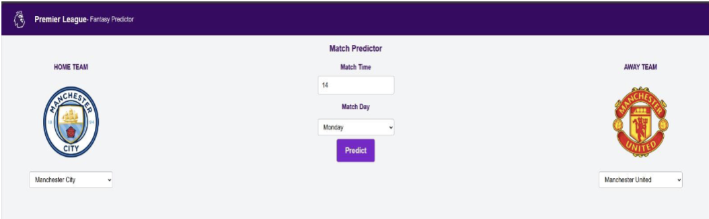

# Evidence provenance

This repository was assembled on October 6, 2026 as a companion to the cumulative midterm report. The CSV, original scraper, and recorded screenshots come from the source project and supplied submissions. Research modules, companion notebooks, tests, and the early React prototype are reconstructed implementations; verification metrics and supplemental model comparisons are separate executions, not original weekly logs. Repository creation and commit dates do not establish semester-week completion dates.

| File | Origin | What it supports |
|---|---|---|
| `recorded_rf_split.png` | Cropped frame from supplied screen recording | Binary setup, Random Forest parameters and chronological boundary. |
| `recorded_rf_metrics.png` | Cropped frame from supplied screen recording | Baseline accuracy, precision and confusion counts. |
| `recorded_rolling_code.png` | Cropped frame from supplied screen recording | Previous-three-match rolling feature method. |
| `recorded_rolling_output.png` | Cropped frame from supplied screen recording | Rolling-data output and complete-history row count. |
| `recorded_rolling_precision.png` | Cropped frame from supplied screen recording | 0.625 win precision, not accuracy. |
| `team_selection_reference.png` | Cropped supplied Milestone 2 screenshot | Team-selection design reference; source combines Weeks 7–8, so exact Week 7 completion is unverified. |

The source recording is `Screen Recording 2025-10-02 193027.mp4`, approximately 3:10 long, with narration centered on Weeks 3–4. It supports the notebook evidence shown here; other stages are documented by the submitted proposal and progress reports.

Screenshots retain actual recorded values. Cropping removes unrelated desktop context; no scores were changed. Private PDFs, teacher annotations and the raw recording are not uploaded here. Supplementary checks belong under `artifacts/verification`, separate from these screenshots.

